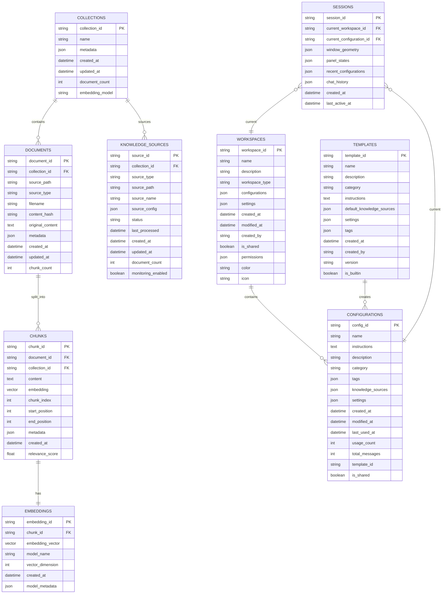

# Custom Gemini Agent GUI - Deployment Guide

## 🚀 **Production Deployment Guide**

This guide provides comprehensive instructions for deploying the Custom Gemini Agent GUI in various environments, from individual use to enterprise deployment.

> 📊 **Architecture Reference**: For detailed visual documentation of the system architecture, service layers, and database schema, see the **[Visual Architecture Guide](VISUAL_ARCHITECTURE_GUIDE.md)**.

## 📋 **Prerequisites**

### **System Requirements**
- **Operating System**: Windows 10+, macOS 10.14+, or Linux (Ubuntu 18.04+)
- **Python**: 3.8 or higher (3.9+ recommended)
- **Memory**: 4GB RAM minimum, 8GB recommended
- **Storage**: 2GB free space (additional space for knowledge bases)
- **Network**: Internet connection for API access and cloud integrations

### **Required Accounts & Services**
- **Google Cloud Console Account** (for Gemini API access)
- **Google Drive API** (optional, for Google Drive integration)
- **GitHub Account** (optional, for repository integration)

## 🔧 **Installation Steps**

### **Step 1: Environment Setup**

#### **1.1 Clone the Repository**
```bash
git clone https://github.com/your-org/custom-gemini-agent-gui.git
cd custom-gemini-agent-gui
```

#### **1.2 Create Virtual Environment**
```bash
# Create virtual environment
python -m venv venv

# Activate virtual environment
# Windows:
venv\Scripts\activate
# macOS/Linux:
source venv/bin/activate
```

#### **1.3 Install Dependencies**

We provide multiple requirements files for different installation scenarios:

**Standard Installation (Recommended)**
```bash
pip install -r requirements.txt
```

**Flexible Installation (If version conflicts occur)**
```bash
pip install -r requirements-flexible.txt
```

**Minimal Installation (Basic functionality only)**
```bash
pip install -r requirements-minimal.txt
```

**Manual Installation (If requirements files fail)**
```bash
# Core dependencies only
pip install PyQt6 google-generativeai chromadb sentence-transformers
pip install PyPDF2 python-docx requests beautifulsoup4 pydantic loguru
pip install watchdog GitPython keyring
```

**Verify Installation**
```bash
python -c "import PyQt6; print('PyQt6 installed successfully')"
python -c "import google.generativeai; print('Gemini API installed successfully')"
python -c "import chromadb; print('ChromaDB installed successfully')"
```

### **Step 2: API Configuration**

#### **2.1 Google Gemini API Setup**
1. **Create Google Cloud Project**:
   - Go to [Google Cloud Console](https://console.cloud.google.com/)
   - Create a new project or select existing one
   - Enable the Gemini API

2. **Generate API Key**:
   - Navigate to "APIs & Services" > "Credentials"
   - Click "Create Credentials" > "API Key"
   - Copy the generated API key

3. **Configure API Key in Application**:
   - Launch the application: `python app/main_window.py`
   - Go to Settings tab
   - Enter your Google Gemini API key
   - Test the connection

#### **2.2 Google Drive Integration (Optional)**
1. **Enable Google Drive API**:
   - In Google Cloud Console, enable "Google Drive API"
   - Create OAuth 2.0 credentials (Desktop Application)
   - Download the credentials JSON file

2. **Configure in Application**:
   - Use the "Add Google Drive" feature
   - Upload the credentials JSON file when prompted
   - Complete OAuth authentication flow

### **Step 3: Initial Configuration**

#### **3.1 First Launch**
```bash
# Navigate to app directory
cd app

# Launch the application
python main_window.py
```

#### **3.2 Basic Setup**
1. **API Configuration**: Enter your Google Gemini API key in Settings
2. **Test Connection**: Verify API connectivity
3. **Create First Configuration**: Use a built-in template or create custom
4. **Add Knowledge Sources**: Start with local files or folders

#### **3.3 Workspace Setup**
1. **Default Workspace**: Application starts with a default workspace
2. **Create Additional Workspaces**: Use Workspace menu for team/project organization
3. **Apply Templates**: Use built-in templates for quick start

## 🏢 **Enterprise Deployment**

### **Multi-User Setup**

#### **Shared Configuration Approach**
```bash
# Create shared configuration directory
mkdir /shared/gemini-configs
chmod 755 /shared/gemini-configs

# Set environment variable for shared configs
export GEMINI_CONFIG_DIR=/shared/gemini-configs
```

#### **Template Distribution**
1. **Create Organization Templates**:
   - Develop standard templates for your organization
   - Export templates using the application
   - Distribute template files to team members

2. **Shared Knowledge Bases**:
   - Set up shared network drives for knowledge sources
   - Configure applications to point to shared locations
   - Implement backup strategies for shared data

### **Security Configuration**

#### **API Key Management**
```bash
# Use environment variables for API keys (recommended)
export GOOGLE_GEMINI_API_KEY="your-api-key-here"

# Or use secure key management systems
# Configure keyring for secure storage
```

#### **Access Control**
- **File Permissions**: Set appropriate permissions on configuration directories
- **Network Security**: Configure firewalls for API access
- **Data Encryption**: Enable encryption for sensitive knowledge bases

### **Backup & Recovery**

#### **Automated Backup Setup**
```bash
# Create backup script
#!/bin/bash
BACKUP_DIR="/backups/gemini-agent"
CONFIG_DIR="$HOME/.config/custom_gemini_agent"

# Create timestamped backup
DATE=$(date +%Y%m%d_%H%M%S)
tar -czf "$BACKUP_DIR/backup_$DATE.tar.gz" "$CONFIG_DIR"

# Keep only last 30 days of backups
find "$BACKUP_DIR" -name "backup_*.tar.gz" -mtime +30 -delete
```

#### **Recovery Procedures**
1. **Configuration Recovery**: Use application's import functionality
2. **Knowledge Base Recovery**: Restore vector databases from backups
3. **Template Recovery**: Import template files from backups

## 🏗️ **Service Architecture Overview**

Understanding the service layer architecture is crucial for proper deployment and customization:

```mermaid
graph TB
    subgraph "Presentation Layer (PyQt6 Widgets)"
        MW[Main Window]
        IW[Instructions Widget]
        KW[Knowledge Widget]
        CW[Chat Widget]
        SW[Settings Widget]
        CMW[Config Manager Widget]
    end

    subgraph "Controller Layer"
        MC[Main Controller]
    end

    subgraph "Service Layer"
        subgraph "Core Services"
            CS[Config Service]
            AS[API Service]
            RS[RAG Service]
        end

        subgraph "Epic 3 Services"
            MS[Monitoring Service]
        end

        subgraph "Epic 4 Services"
            GDS[Google Drive Service]
            WSS[Web Scraping Service]
            BPS[Batch Processing Service]
        end

        subgraph "Epic 5 Services"
            TS[Template Service]
            WS[Workspace Service]
            IES[Import/Export Service]
            SS[Session Service]
        end
    end

    subgraph "Data Layer"
        subgraph "Configuration Storage"
            CONFIG_FILES[(Config Files)]
            WORKSPACE_FILES[(Workspace Files)]
            TEMPLATE_FILES[(Template Files)]
            SESSION_FILES[(Session Files)]
        end

        subgraph "Knowledge Storage"
            CHROMA_DB[(ChromaDB)]
            VECTOR_INDEX[(Vector Index)]
            METADATA_STORE[(Metadata)]
        end

        subgraph "External APIs"
            GEMINI_API[Google Gemini API]
            GDRIVE_API[Google Drive API]
            GITHUB_API[GitHub API]
        end
    end

    %% Widget to Controller connections
    MW --> MC
    IW --> MC
    KW --> MC
    CW --> MC
    SW --> MC
    CMW --> MC

    %% Controller to Service connections
    MC --> CS
    MC --> AS
    MC --> RS
    MC --> MS
    MC --> GDS
    MC --> WSS
    MC --> BPS
    MC --> TS
    MC --> WS
    MC --> IES
    MC --> SS

    %% Service to Data Layer connections
    CS --> CONFIG_FILES
    WS --> WORKSPACE_FILES
    TS --> TEMPLATE_FILES
    SS --> SESSION_FILES

    RS --> CHROMA_DB
    RS --> VECTOR_INDEX
    RS --> METADATA_STORE

    AS --> GEMINI_API
    GDS --> GDRIVE_API
    WSS --> GITHUB_API

    classDef widgets fill:#e3f2fd
    classDef controller fill:#f3e5f5
    classDef coreServices fill:#e8f5e8
    classDef epic3Services fill:#fff3e0
    classDef epic4Services fill:#fce4ec
    classDef epic5Services fill:#f1f8e9
    classDef storage fill:#f5f5f5
    classDef apis fill:#ffebee

    class MW,IW,KW,CW,SW,CMW widgets
    class MC controller
    class CS,AS,RS coreServices
    class MS epic3Services
    class GDS,WSS,BPS epic4Services
    class TS,WS,IES,SS epic5Services
    class CONFIG_FILES,WORKSPACE_FILES,TEMPLATE_FILES,SESSION_FILES,CHROMA_DB,VECTOR_INDEX,METADATA_STORE storage
    class GEMINI_API,GDRIVE_API,GITHUB_API apis
```



## 🔧 **Advanced Configuration**

### **Performance Optimization**

#### **Memory Configuration**
```python
# In app/services/config_service.py, adjust:
CHUNK_SIZE = 1000  # Reduce for lower memory usage
MAX_CHUNKS_PER_FILE = 100  # Limit chunks per file
BATCH_SIZE = 10  # Reduce batch processing size
```

#### **Vector Database Optimization**
```python
# ChromaDB settings for large deployments
CHROMA_SETTINGS = {
    "anonymized_telemetry": False,
    "allow_reset": True,
    "persist_directory": "./chroma_db"
}
```

### **Database Schema Understanding**

The application uses ChromaDB for vector storage with a sophisticated schema designed for enterprise scalability:



**Key Schema Features:**
- **Hierarchical Structure**: Collections → Documents → Chunks → Embeddings
- **Metadata Rich**: Comprehensive metadata for all entities
- **Relationship Tracking**: Foreign keys maintain data integrity
- **Performance Optimized**: Indexes on frequently queried fields
- **Audit Trail**: Creation and modification timestamps throughout

### **Integration Configuration**

#### **Proxy Settings**
```bash
# Configure proxy for API access
export HTTP_PROXY=http://proxy.company.com:8080
export HTTPS_PROXY=http://proxy.company.com:8080
```

#### **Custom Knowledge Sources**
```python
# Add custom source types in models/knowledge_source.py
class SourceType(str, Enum):
    # ... existing types ...
    CUSTOM_API = "custom_api"
    DATABASE = "database"
    SHAREPOINT = "sharepoint"
```

## 🐳 **Docker Deployment**

### **Dockerfile**
```dockerfile
FROM python:3.9-slim

# Install system dependencies
RUN apt-get update && apt-get install -y \
    qt6-base-dev \
    libgl1-mesa-glx \
    && rm -rf /var/lib/apt/lists/*

# Set working directory
WORKDIR /app

# Copy requirements and install Python dependencies
COPY requirements.txt .
RUN pip install --no-cache-dir -r requirements.txt

# Copy application code
COPY app/ ./app/
COPY docs/ ./docs/

# Create data directory
RUN mkdir -p /data

# Set environment variables
ENV GEMINI_CONFIG_DIR=/data
ENV DISPLAY=:0

# Expose port for web interface (if implemented)
EXPOSE 8080

# Run application
CMD ["python", "app/main_window.py"]
```

### **Docker Compose**
```yaml
version: '3.8'
services:
  gemini-agent:
    build: .
    volumes:
      - ./data:/data
      - /tmp/.X11-unix:/tmp/.X11-unix:rw
    environment:
      - DISPLAY=${DISPLAY}
      - GOOGLE_GEMINI_API_KEY=${GOOGLE_GEMINI_API_KEY}
    network_mode: host
```

## 🛠️ **Troubleshooting**

### **Common Installation Issues**

#### **PyInstaller Version Error**
```bash
# Error: Could not find a version that satisfies the requirement PyInstaller==6.3.0
# Solution: Use a valid PyInstaller version
pip install PyInstaller==6.14.1
# Or use the flexible requirements file
pip install -r requirements-flexible.txt
```

#### **PyQt6 Installation Issues**
```bash
# On Ubuntu/Debian
sudo apt-get install python3-pyqt6 python3-pyqt6-dev

# On macOS with Homebrew
brew install pyqt6

# On Windows, try upgrading pip first
python -m pip install --upgrade pip
pip install PyQt6
```

#### **ChromaDB Installation Issues**
```bash
# If ChromaDB fails to install, try:
pip install --upgrade pip setuptools wheel
pip install chromadb --no-cache-dir

# For Apple Silicon Macs:
pip install chromadb --no-deps
pip install onnxruntime
```

#### **Google API Dependencies**
```bash
# If Google API packages fail:
pip install google-api-python-client google-auth google-auth-oauthlib
```

### **Runtime Issues**

#### **API Key Configuration**
- **Issue**: "Invalid API key" errors
- **Solution**:
  1. Verify API key in Google Cloud Console
  2. Ensure Gemini API is enabled
  3. Check API key permissions and quotas

#### **Memory Issues**
- **Issue**: Application crashes with large knowledge bases
- **Solution**:
  1. Reduce chunk size in configuration
  2. Process files in smaller batches
  3. Increase system memory or use swap

#### **File Permission Issues**
- **Issue**: Cannot save configurations or access knowledge sources
- **Solution**:
  1. Check file/folder permissions
  2. Run with appropriate user privileges
  3. Verify disk space availability

### **Performance Issues**

#### **Slow Knowledge Processing**
- **Issue**: Document processing takes too long
- **Solutions**:
  1. Use batch processing for multiple files
  2. Reduce chunk overlap settings
  3. Filter out unnecessary file types

#### **UI Responsiveness**
- **Issue**: Interface becomes unresponsive
- **Solutions**:
  1. Enable background processing
  2. Reduce concurrent operations
  3. Check system resource usage

## 🔍 **Monitoring & Maintenance**

### **Health Checks**
```bash
# Create health check script
#!/bin/bash
# Check if application is running
pgrep -f "python.*main_window.py" > /dev/null
if [ $? -eq 0 ]; then
    echo "Application is running"
    exit 0
else
    echo "Application is not running"
    exit 1
fi
```

### **Log Management**
```python
# Configure logging in app/main_window.py
import logging
from loguru import logger

# Set up log rotation
logger.add(
    "logs/app_{time:YYYY-MM-DD}.log",
    rotation="1 day",
    retention="30 days",
    level="INFO"
)
```

### **Performance Monitoring**
```bash
# Monitor resource usage
#!/bin/bash
while true; do
    echo "$(date): $(ps aux | grep 'python.*main_window.py' | grep -v grep | awk '{print $3, $4}')" >> performance.log
    sleep 60
done
```

## 🚨 **Troubleshooting**

### **Common Issues**

#### **API Connection Problems**
```bash
# Test API connectivity
curl -H "Authorization: Bearer YOUR_API_KEY" \
     "https://generativelanguage.googleapis.com/v1/models"
```

#### **PyQt6 Display Issues**
```bash
# Linux: Install required packages
sudo apt-get install python3-pyqt6 python3-pyqt6.qtquick

# macOS: Install via Homebrew
brew install pyqt6

# Windows: Ensure proper Python installation
pip install --upgrade PyQt6
```

#### **Memory Issues**
- Reduce chunk size in configuration
- Limit concurrent batch processing
- Clear chat history regularly
- Monitor vector database size

### **Debug Mode**
```bash
# Run with debug logging
export PYTHONPATH=$PWD/app
python -c "
import logging
logging.basicConfig(level=logging.DEBUG)
from main_window import main
main()
"
```

## 📊 **Deployment Validation**

### **Validation Checklist**
- [ ] API connectivity verified
- [ ] All dependencies installed correctly
- [ ] UI launches without errors
- [ ] Knowledge sources can be added and processed
- [ ] Chat functionality works with responses
- [ ] Configuration save/load works
- [ ] Templates are available and functional
- [ ] Import/export functionality works
- [ ] Session persistence works across restarts

### **Performance Testing**
```bash
# Run the demo script for validation
python demo.py

# Expected output: All services should show ✓
```

## 🎯 **Production Readiness**

### **Security Checklist**
- [ ] API keys stored securely (not in code)
- [ ] File permissions set appropriately
- [ ] Network access configured properly
- [ ] Backup procedures implemented
- [ ] Update procedures documented

### **Operational Checklist**
- [ ] Monitoring systems in place
- [ ] Log rotation configured
- [ ] Backup automation set up
- [ ] Documentation accessible to team
- [ ] Support procedures defined

## 📞 **Support & Resources**

### **Documentation**
- **User Manual**: `docs/USER_MANUAL.md`
- **API Documentation**: `docs/API_REFERENCE.md`
- **Architecture Guide**: `docs/ARCHITECTURE.md`

### **Community & Support**
- **GitHub Issues**: Report bugs and feature requests
- **Documentation**: Comprehensive guides and tutorials
- **Examples**: Sample configurations and templates

---

**The Custom Gemini Agent GUI is now ready for production deployment. Follow this guide for successful installation and configuration in your environment.**
