# Custom Gemini Agent GUI

## 🎯 **Enterprise-Ready AI Assistant Platform**

A sophisticated desktop application for creating, managing, and deploying custom AI assistants powered by Google's Gemini Pro API. Features advanced knowledge management, multi-workspace support, professional templates, and enterprise-grade configuration capabilities.

[](https://www.python.org/downloads/)
[](https://pypi.org/project/PyQt6/)
[](https://opensource.org/licenses/MIT)
[]()

## ✨ **Key Features**

### 🧠 **Advanced Knowledge Management**
- **Multiple Source Types**: Local files, GitHub repositories, Google Drive folders, web content
- **25+ File Formats**: PDF, DOCX, TXT, MD, code files, and more
- **Intelligent Processing**: Automatic text extraction, chunking, and semantic indexing
- **Vector Database**: Persistent ChromaDB storage with semantic search
- **Real-time Monitoring**: Automatic updates when knowledge sources change
- **Batch Processing**: Parallel processing of large knowledge bases

### 🏢 **Multi-Workspace Organization**
- **Workspace Types**: Personal, Team, Project, Template workspaces
- **Configuration Management**: Organize AI assistants by purpose and team
- **Template System**: 6 built-in professional templates + custom template creation
- **Import/Export**: Comprehensive sharing and collaboration capabilities
- **Usage Analytics**: Track configuration usage, performance, and insights

### 🚀 **Professional Features**
- **Session Persistence**: Complete state management across application sessions
- **Advanced UI**: Professional configuration management with tabbed interface
- **Backup & Restore**: Enterprise-grade data protection and recovery
- **OAuth Integration**: Secure Google Drive and API authentication
- **Conflict Resolution**: Smart handling of import/export conflicts

## 🎨 **Built-in Professional Templates**

Get started quickly with our professionally crafted templates:

| Template | Purpose | Use Cases |
|----------|---------|-----------|
| 🔬 **Research Assistant** | Research and analysis | Academic research, market analysis, data investigation |
| 💻 **Code Assistant** | Programming support | Code review, debugging, architecture guidance |
| ✍️ **Writing Assistant** | Content creation | Technical writing, documentation, creative content |
| 📊 **Business Analyst** | Business strategy | Market analysis, strategic planning, process optimization |
| 🎓 **Learning Tutor** | Education support | Personalized tutoring, curriculum development, assessment |
| 🎨 **Creative Assistant** | Creative projects | Brainstorming, creative writing, design ideation |

## 🚀 **Quick Start**

### **1. Installation**
```bash
# Clone the repository
git clone https://github.com/usemanusai/Google-Gems.git
cd Google-Gems

# Create virtual environment
python -m venv venv
source venv/bin/activate  # On Windows: venv\Scripts\activate

# Install dependencies (choose the best option for your system)

# Latest versions (June 12, 2025) - Recommended
pip install -r requirements-latest-2025.txt

# Windows-specific (solves lxml issues)
pip install -r requirements-windows-2025.txt

# Alternative installation options
# pip install -r requirements.txt           # Original versions
# pip install -r requirements-flexible.txt  # For version conflicts
# pip install -r requirements-minimal.txt   # For basic functionality

# Verify installation
python verify_installation.py
```

### **2. API Setup**
1. Get your [Google Gemini API key](https://makersuite.google.com/app/apikey)
2. Launch the application: `python app/main_window.py`
3. Go to Settings → Enter API key → Test connection

### **3. Create Your First Assistant**
1. **Choose Template**: Select from 6 professional templates
2. **Add Knowledge**: Upload files, connect GitHub repos, or add web content
3. **Customize Instructions**: Tailor the AI's behavior and expertise
4. **Start Chatting**: Interact with your knowledge-enhanced AI assistant

## 📊 **System Requirements**

| Component | Minimum | Recommended |
|-----------|---------|-------------|
| **Python** | 3.8+ | 3.9+ |
| **RAM** | 4GB | 8GB+ |
| **Storage** | 2GB free | 5GB+ |
| **OS** | Windows 10+, macOS 10.14+, Ubuntu 18.04+ | Latest versions |
| **Network** | Internet connection for API access | Stable broadband |

## 📚 **Documentation**

| Document | Description |
|----------|-------------|
| **[User Manual](USER_MANUAL.md)** | Complete user guide with tutorials |
| **[Deployment Guide](DEPLOYMENT_GUIDE.md)** | Installation and enterprise deployment |
| **[Visual Architecture Guide](VISUAL_ARCHITECTURE_GUIDE.md)** | Comprehensive visual documentation with diagrams |
| **[Project Summary](PROJECT_FINAL_SUMMARY.md)** | Complete project overview and achievements |
| **[Epic Summaries](/)** | Detailed implementation summaries for each epic |
| **[Changelog](CHANGELOG.md)** | Version history and feature additions |

## 🎯 **Use Cases**

### **Individual Professionals**
- **Researchers**: Create AI assistants with access to research papers and data
- **Developers**: Build coding assistants with project documentation and best practices
- **Writers**: Develop writing assistants with style guides and reference materials
- **Consultants**: Create domain-specific assistants with industry knowledge

### **Teams & Organizations**
- **Development Teams**: Shared coding assistants with team standards and documentation
- **Marketing Teams**: Brand-aware content assistants with guidelines and assets
- **Support Teams**: Customer service assistants with product knowledge and FAQs
- **Training Organizations**: Educational assistants with curriculum and materials

### **Enterprise Deployment**
- **Knowledge Management**: Centralized AI assistants with organizational knowledge
- **Standardization**: Template-driven assistant creation for consistency
- **Collaboration**: Shared workspaces and configuration management
- **Compliance**: Secure, auditable AI assistant deployment

## 🏗️ **Architecture Overview**

The Custom Gemini Agent GUI is built with a sophisticated multi-layered architecture spanning 5 major epics, each contributing essential capabilities to create a comprehensive AI assistant platform.

```mermaid
graph TB
    subgraph "Epic 1: Core Infrastructure"
        UI[PyQt6 UI Framework]
        API[Google Gemini API]
        CONFIG[Configuration Management]
        LOG[Logging System]
    end

    subgraph "Epic 2: Enhanced UI/UX"
        MAIN[Main Window]
        INST[Instructions Widget]
        KNOW[Knowledge Widget]
        CHAT[Chat Widget]
        SET[Settings Widget]
    end

    subgraph "Epic 3: Persistent RAG"
        CHROMA[ChromaDB Vector Store]
        EMBED[Text Embedding]
        CHUNK[Document Chunking]
        SEARCH[Semantic Search]
        MONITOR[File Monitoring]
    end

    subgraph "Epic 4: Advanced Ingestion"
        LOCAL[Local Files/Folders]
        GITHUB[GitHub Integration]
        GDRIVE[Google Drive API]
        WEB[Web Scraping]
        BATCH[Batch Processing]
    end

    subgraph "Epic 5: Configuration Management"
        WORKSPACE[Multi-Workspace]
        TEMPLATE[Template System]
        IMPORT[Import/Export]
        SESSION[Session Management]
        MANAGER[Config Manager UI]
    end

    subgraph "Core Services Layer"
        CONTROLLER[Main Controller]
        RAGSERV[RAG Service]
        APISERVICE[API Service]
        CONFIGSERV[Config Service]
        WORKSERV[Workspace Service]
        TEMPSERV[Template Service]
        SESSSERV[Session Service]
        IMPEXPSERV[Import/Export Service]
    end

    %% Epic 1 Connections
    UI --> MAIN
    API --> APISERVICE
    CONFIG --> CONFIGSERV

    %% Epic 2 Connections
    MAIN --> INST
    MAIN --> KNOW
    MAIN --> CHAT
    MAIN --> SET

    %% Epic 3 Connections
    RAGSERV --> CHROMA
    RAGSERV --> EMBED
    RAGSERV --> CHUNK
    RAGSERV --> SEARCH
    MONITOR --> RAGSERV

    %% Epic 4 Connections
    LOCAL --> RAGSERV
    GITHUB --> RAGSERV
    GDRIVE --> RAGSERV
    WEB --> RAGSERV
    BATCH --> RAGSERV

    %% Epic 5 Connections
    WORKSPACE --> WORKSERV
    TEMPLATE --> TEMPSERV
    IMPORT --> IMPEXPSERV
    SESSION --> SESSSERV
    MANAGER --> WORKSERV

    %% Service Layer Connections
    CONTROLLER --> RAGSERV
    CONTROLLER --> APISERVICE
    CONTROLLER --> CONFIGSERV
    CONTROLLER --> WORKSERV
    CONTROLLER --> TEMPSERV
    CONTROLLER --> SESSSERV
    CONTROLLER --> IMPEXPSERV

    %% UI to Controller
    MAIN --> CONTROLLER
    INST --> CONTROLLER
    KNOW --> CONTROLLER
    CHAT --> CONTROLLER
    SET --> CONTROLLER
    MANAGER --> CONTROLLER

    %% Data Flow
    CHROMA --> APISERVICE
    APISERVICE --> CHAT

    classDef epic1 fill:#e1f5fe
    classDef epic2 fill:#f3e5f5
    classDef epic3 fill:#e8f5e8
    classDef epic4 fill:#fff3e0
    classDef epic5 fill:#fce4ec
    classDef services fill:#f5f5f5

    class UI,API,CONFIG,LOG epic1
    class MAIN,INST,KNOW,CHAT,SET epic2
    class CHROMA,EMBED,CHUNK,SEARCH,MONITOR epic3
    class LOCAL,GITHUB,GDRIVE,WEB,BATCH epic4
    class WORKSPACE,TEMPLATE,IMPORT,SESSION,MANAGER epic5
    class CONTROLLER,RAGSERV,APISERVICE,CONFIGSERV,WORKSERV,TEMPSERV,SESSSERV,IMPEXPSERV services
```



### **Epic-Based Architecture**
Each epic contributes essential capabilities:
- **Epic 1**: Foundation with secure API integration and configuration management
- **Epic 2**: Professional UI/UX with intuitive three-panel design
- **Epic 3**: Advanced RAG system with persistent vector storage and semantic search
- **Epic 4**: Comprehensive knowledge ingestion from multiple sources
- **Epic 5**: Enterprise-grade configuration and session management

## 🔧 **Advanced Features**

### **Knowledge Source Integration**

The application features a sophisticated RAG (Retrieval-Augmented Generation) pipeline that processes diverse knowledge sources and provides contextually relevant AI responses:

```mermaid
flowchart TD
    subgraph "Knowledge Sources"
        FILES[📄 Local Files]
        FOLDERS[📁 Folders]
        GITHUB[🐙 GitHub Repos]
        GDRIVE[☁️ Google Drive]
        WEB[🌐 Web Content]
    end

    subgraph "Document Processing Pipeline"
        DETECT[🔍 Format Detection]
        EXTRACT[📝 Text Extraction]
        CLEAN[🧹 Text Cleaning]
        CHUNK[✂️ Text Chunking]
        EMBED[🧠 Generate Embeddings]
    end

    subgraph "Vector Storage"
        CHROMA[(🗄️ ChromaDB)]
        METADATA[📊 Metadata Store]
        INDEX[🔗 Vector Index]
    end

    subgraph "Query Processing"
        USER_Q[❓ User Question]
        Q_EMBED[🧠 Query Embedding]
        SEARCH[🔍 Semantic Search]
        RETRIEVE[📋 Retrieve Context]
        RANK[📈 Relevance Ranking]
    end

    subgraph "AI Response Generation"
        CONTEXT[📄 Context Assembly]
        PROMPT[💭 Prompt Construction]
        GEMINI[🤖 Google Gemini API]
        RESPONSE[💬 AI Response]
        CITATIONS[📚 Source Citations]
    end

    %% Document Ingestion Flow
    FILES --> DETECT
    FOLDERS --> DETECT
    GITHUB --> DETECT
    GDRIVE --> DETECT
    WEB --> DETECT

    DETECT --> EXTRACT
    EXTRACT --> CLEAN
    CLEAN --> CHUNK
    CHUNK --> EMBED

    %% Storage Flow
    EMBED --> CHROMA
    CHUNK --> METADATA
    EMBED --> INDEX

    %% Query Flow
    USER_Q --> Q_EMBED
    Q_EMBED --> SEARCH
    SEARCH --> CHROMA
    CHROMA --> RETRIEVE
    RETRIEVE --> RANK

    %% Response Generation Flow
    RANK --> CONTEXT
    USER_Q --> PROMPT
    CONTEXT --> PROMPT
    PROMPT --> GEMINI
    GEMINI --> RESPONSE
    CONTEXT --> CITATIONS

    classDef sources fill:#e3f2fd
    classDef processing fill:#f1f8e9
    classDef storage fill:#fff3e0
    classDef query fill:#fce4ec
    classDef ai fill:#f3e5f5

    class FILES,FOLDERS,GITHUB,GDRIVE,WEB sources
    class DETECT,EXTRACT,CLEAN,CHUNK,EMBED processing
    class CHROMA,METADATA,INDEX storage
    class USER_Q,Q_EMBED,SEARCH,RETRIEVE,RANK query
    class CONTEXT,PROMPT,GEMINI,RESPONSE,CITATIONS ai
```



**Supported Source Types:**
```python
✅ Local Files & Folders      # PDF, DOCX, TXT, MD, code files
✅ GitHub Repositories        # Public and private repos with OAuth
✅ Google Drive Folders       # Documents, sheets, presentations
✅ Web Content               # Single pages, crawling, sitemaps
✅ Real-time Monitoring      # Automatic updates on file changes
✅ Batch Processing          # Parallel processing with progress tracking
```

### **Workspace Management**
```python
# Workspace capabilities
✅ Multi-workspace Support   # Personal, Team, Project, Template
✅ Configuration Organization # Group assistants by purpose
✅ Template System           # Built-in and custom templates
✅ Import/Export            # Share configurations and collaborate
✅ Usage Analytics          # Track performance and insights
✅ Session Persistence      # Complete state management
```

## Development

### Running Tests

```bash
pytest
```

### Code Formatting

```bash
black app/ tests/
```

### Type Checking

```bash
mypy app/
```

## 🧪 **Testing & Quality**

```bash
# Run comprehensive test suite
python -m pytest tests/

# Run demo validation
python demo.py

# Expected output: All services should show ✓
```

### **Quality Assurance**
- ✅ **Comprehensive Test Coverage**: Unit and integration tests for all components
- ✅ **Production Validation**: Tested with large knowledge bases and enterprise scenarios
- ✅ **Error Handling**: Graceful degradation and recovery mechanisms
- ✅ **Performance Optimization**: Efficient memory usage and processing
- ✅ **Security**: Secure credential management and data handling

## 🚀 **Deployment Options**

### **Desktop Application**
```bash
# Standard desktop deployment
python app/main_window.py
```

### **Enterprise Setup**
- **Multi-user Configuration**: Shared templates and workspaces
- **Centralized Knowledge**: Shared knowledge bases and sources
- **Security Integration**: OAuth, SSO, and access control
- **Monitoring & Analytics**: Usage tracking and performance monitoring

## 🤝 **Contributing**

We welcome contributions! Please see our [Contributing Guide](CONTRIBUTING.md) for:
- 🔧 Development setup and environment
- 📝 Code style and standards
- 🧪 Testing requirements and procedures
- 📋 Pull request process and guidelines

## 📄 **License**

This project is licensed under the MIT License - see the [LICENSE](LICENSE) file for details.

## 🆘 **Support & Community**

- **📖 Documentation**: Comprehensive guides and tutorials
- **🐛 GitHub Issues**: Bug reports and feature requests
- **💬 Discussions**: Community support and Q&A
- **📧 Enterprise Support**: Contact for enterprise deployment assistance

## 🙏 **Acknowledgments**

- **Google Gemini**: Advanced AI technology powering the assistants
- **PyQt6**: Professional cross-platform UI framework
- **ChromaDB**: High-performance vector database for semantic search
- **Open Source Community**: Libraries and tools that make this project possible

## 📈 **Project Status**

### **✅ Complete & Production Ready**
- **Epic 1**: Core Infrastructure & Foundation
- **Epic 2**: Enhanced UI/UX & Professional Interface
- **Epic 3**: Persistent RAG Implementation
- **Epic 4**: Advanced Knowledge Ingestion Methods
- **Epic 5**: Configuration & Session Management

### **🎯 Ready For**
- ✅ **Production Deployment** in professional environments
- ✅ **Enterprise Adoption** with full feature sets and security
- ✅ **Team Collaboration** with multi-workspace and sharing capabilities
- ✅ **Continued Enhancement** with extensible architecture

---

## 🎊 **Transform Your AI Interactions**

**Create custom AI assistants tailored to your specific needs, knowledge domains, and workflows. From individual productivity to enterprise deployment, the Custom Gemini Agent GUI provides the tools and flexibility to build the AI assistants you need.**

**[Get Started Now](USER_MANUAL.md) | [View Documentation](docs/) | [Enterprise Deployment](DEPLOYMENT_GUIDE.md)**