# Custom Gemini Agent GUI - User Manual

## 📖 **Complete User Guide**

Welcome to the Custom Gemini Agent GUI - your comprehensive platform for creating, managing, and deploying custom AI assistants with advanced knowledge management capabilities.

> 📊 **Visual Guide**: For comprehensive visual documentation including architecture diagrams, workflows, and data structures, see the **[Visual Architecture Guide](VISUAL_ARCHITECTURE_GUIDE.md)**.

## 🚀 **Getting Started**

### **First Launch**
1. **Start the Application**: Launch the Custom Gemini Agent GUI
2. **API Setup**: Go to Settings and enter your Google Gemini API key
3. **Test Connection**: Verify your API connection is working
4. **Choose a Template**: Select from built-in templates or create a custom configuration

### **Quick Start with Templates**
The application includes 6 professional templates to get you started:

- **Research Assistant**: For research and analysis tasks
- **Code Assistant**: For programming and development
- **Writing Assistant**: For content creation and editing
- **Business Analyst**: For business analysis and strategy
- **Learning Tutor**: For education and tutoring
- **Creative Assistant**: For creative projects and brainstorming

## 🏗️ **Interface Overview**

### **Main Window Layout**
The application features a three-panel design:

1. **Left Panel - Instructions**: Configure your AI assistant's behavior and personality
2. **Center Panel - Knowledge Sources**: Manage your knowledge base and data sources
3. **Right Panel - Chat**: Interact with your custom AI assistant

### **Menu System**
- **File**: Configuration management, import/export, backup operations
- **Workspace**: Multi-workspace management and organization
- **Templates**: Template application and creation
- **Settings**: API configuration and application preferences

## 🧠 **Creating Your AI Assistant**

The Custom Gemini Agent GUI provides multiple pathways for creating sophisticated AI assistants. Follow this comprehensive workflow to build your perfect AI companion:

```mermaid
flowchart TD
    START([👤 User Starts]) --> CHOICE{Choose Creation Method}

    CHOICE -->|Template| TEMPLATE[📋 Select Template]
    CHOICE -->|Custom| CUSTOM[✏️ Create Custom]

    TEMPLATE --> TEMPLATE_LIST[📚 Browse Templates]
    TEMPLATE_LIST --> SELECT_TEMPLATE[✅ Select Template]
    SELECT_TEMPLATE --> NAME_CONFIG[📝 Name Configuration]

    CUSTOM --> WRITE_INSTRUCTIONS[✍️ Write Instructions]

    NAME_CONFIG --> CUSTOMIZE_INSTRUCTIONS[🔧 Customize Instructions]
    WRITE_INSTRUCTIONS --> CUSTOMIZE_INSTRUCTIONS

    CUSTOMIZE_INSTRUCTIONS --> ADD_KNOWLEDGE{Add Knowledge Sources?}

    ADD_KNOWLEDGE -->|Yes| KNOWLEDGE_TYPE{Select Source Type}
    ADD_KNOWLEDGE -->|No| SAVE_CONFIG[💾 Save Configuration]

    KNOWLEDGE_TYPE -->|Files| ADD_FILES[📄 Add Local Files]
    KNOWLEDGE_TYPE -->|Folders| ADD_FOLDERS[📁 Add Folders]
    KNOWLEDGE_TYPE -->|GitHub| ADD_GITHUB[🐙 Add GitHub Repo]
    KNOWLEDGE_TYPE -->|Google Drive| ADD_GDRIVE[☁️ Add Google Drive]
    KNOWLEDGE_TYPE -->|Web| ADD_WEB[🌐 Add Web Content]

    ADD_FILES --> PROCESS_SOURCES[⚙️ Process Sources]
    ADD_FOLDERS --> PROCESS_SOURCES
    ADD_GITHUB --> PROCESS_SOURCES
    ADD_GDRIVE --> PROCESS_SOURCES
    ADD_WEB --> PROCESS_SOURCES

    PROCESS_SOURCES --> MORE_SOURCES{Add More Sources?}
    MORE_SOURCES -->|Yes| KNOWLEDGE_TYPE
    MORE_SOURCES -->|No| SAVE_CONFIG

    SAVE_CONFIG --> SELECT_WORKSPACE[🏢 Select Workspace]
    SELECT_WORKSPACE --> TEST_AGENT[🧪 Test Agent]
    TEST_AGENT --> REFINE{Need Refinement?}

    REFINE -->|Yes| CUSTOMIZE_INSTRUCTIONS
    REFINE -->|No| COMPLETE([✅ Agent Ready])

    classDef start fill:#e8f5e8
    classDef process fill:#e3f2fd
    classDef decision fill:#fff3e0
    classDef action fill:#f3e5f5
    classDef complete fill:#e1f5fe

    class START,COMPLETE start
    class TEMPLATE_LIST,SELECT_TEMPLATE,NAME_CONFIG,WRITE_INSTRUCTIONS,CUSTOMIZE_INSTRUCTIONS,ADD_FILES,ADD_FOLDERS,ADD_GITHUB,ADD_GDRIVE,ADD_WEB,PROCESS_SOURCES,SAVE_CONFIG,SELECT_WORKSPACE,TEST_AGENT process
    class CHOICE,ADD_KNOWLEDGE,KNOWLEDGE_TYPE,MORE_SOURCES,REFINE decision
    class TEMPLATE,CUSTOM action
```



### **Step 1: Define Instructions**
1. **Open Instructions Panel**: Left panel of the main window
2. **Write Clear Instructions**: Define your assistant's role, expertise, and behavior
3. **Be Specific**: Include specific tasks, tone, and response style
4. **Use Examples**: Provide examples of desired responses

**Example Instructions:**
```
You are a technical documentation assistant. Your role is to:
1. Help create clear, comprehensive technical documentation
2. Review and improve existing documentation for clarity
3. Suggest best practices for documentation structure
4. Maintain a professional, helpful tone

Always ask clarifying questions when requirements are unclear.
```

### **Step 2: Add Knowledge Sources**
1. **Open Knowledge Panel**: Center panel of the main window
2. **Choose Source Type**: Files, folders, GitHub repos, Google Drive, or web content
3. **Configure Sources**: Set up your knowledge base with relevant information
4. **Process Sources**: Let the system index and prepare your knowledge

**Supported Source Types:**
- **Local Files**: Documents, PDFs, text files, code files
- **Folders**: Entire directories with automatic monitoring
- **GitHub Repositories**: Public and private repositories
- **Google Drive**: Folders and documents with OAuth integration
- **Web Content**: Single pages, website crawling, or sitemap extraction

### **Step 3: Test and Refine**
1. **Start Chatting**: Use the right panel to interact with your assistant
2. **Test Knowledge**: Ask questions about your knowledge sources
3. **Refine Instructions**: Adjust based on responses and behavior
4. **Add More Sources**: Expand knowledge base as needed

## 📁 **Knowledge Source Management**

The application supports comprehensive knowledge ingestion from multiple sources with intelligent processing and batch capabilities:

```mermaid
flowchart TD
    START([📚 Add Knowledge]) --> SOURCE_TYPE{Select Source Type}

    SOURCE_TYPE -->|Local Files| LOCAL_FILES[📄 Select Files]
    SOURCE_TYPE -->|Folders| LOCAL_FOLDERS[📁 Select Folder]
    SOURCE_TYPE -->|GitHub| GITHUB_REPO[🐙 Enter GitHub URL]
    SOURCE_TYPE -->|Google Drive| GDRIVE_AUTH{Authenticated?}
    SOURCE_TYPE -->|Web Content| WEB_CONFIG[🌐 Configure Web Source]

    LOCAL_FILES --> VALIDATE_FILES[✅ Validate Files]
    LOCAL_FOLDERS --> MONITOR_OPTION{Enable Monitoring?}

    MONITOR_OPTION -->|Yes| ENABLE_MONITOR[👁️ Enable File Monitoring]
    MONITOR_OPTION -->|No| VALIDATE_FOLDER[✅ Validate Folder]
    ENABLE_MONITOR --> VALIDATE_FOLDER

    GITHUB_REPO --> GITHUB_AUTH{Private Repo?}
    GITHUB_AUTH -->|Yes| GITHUB_TOKEN[🔑 Enter GitHub Token]
    GITHUB_AUTH -->|No| CLONE_REPO[📥 Clone Repository]
    GITHUB_TOKEN --> CLONE_REPO

    GDRIVE_AUTH -->|No| GDRIVE_SETUP[🔧 Setup Google Drive]
    GDRIVE_AUTH -->|Yes| GDRIVE_FOLDER[📁 Select Drive Folder]
    GDRIVE_SETUP --> GDRIVE_CREDS[📋 Upload Credentials]
    GDRIVE_CREDS --> OAUTH_FLOW[🔐 OAuth Authentication]
    OAUTH_FLOW --> GDRIVE_FOLDER

    WEB_CONFIG --> WEB_MODE{Select Mode}
    WEB_MODE -->|Single Page| SINGLE_URL[🔗 Enter URL]
    WEB_MODE -->|Crawl Website| CRAWL_CONFIG[🕷️ Configure Crawling]
    WEB_MODE -->|From Sitemap| SITEMAP_URL[🗺️ Enter Sitemap URL]

    CRAWL_CONFIG --> MAX_PAGES[📊 Set Max Pages]
    MAX_PAGES --> DOMAIN_RESTRICT[🔒 Domain Restrictions]
    DOMAIN_RESTRICT --> START_CRAWL[🚀 Start Crawling]

    VALIDATE_FILES --> BATCH_OPTION{Batch Process?}
    VALIDATE_FOLDER --> BATCH_OPTION
    CLONE_REPO --> BATCH_OPTION
    GDRIVE_FOLDER --> BATCH_OPTION
    SINGLE_URL --> BATCH_OPTION
    START_CRAWL --> BATCH_OPTION
    SITEMAP_URL --> BATCH_OPTION

    BATCH_OPTION -->|Yes| BATCH_QUEUE[📋 Add to Batch Queue]
    BATCH_OPTION -->|No| PROCESS_INDIVIDUAL[⚙️ Process Individual]

    BATCH_QUEUE --> MORE_SOURCES{Add More Sources?}
    MORE_SOURCES -->|Yes| SOURCE_TYPE
    MORE_SOURCES -->|No| START_BATCH[🚀 Start Batch Processing]

    START_BATCH --> BATCH_PROGRESS[📊 Monitor Progress]
    PROCESS_INDIVIDUAL --> INDIVIDUAL_PROGRESS[📊 Monitor Progress]

    BATCH_PROGRESS --> BATCH_COMPLETE{All Complete?}
    INDIVIDUAL_PROGRESS --> INDIVIDUAL_COMPLETE{Complete?}

    BATCH_COMPLETE -->|No| BATCH_PROGRESS
    BATCH_COMPLETE -->|Yes| REVIEW_RESULTS[📋 Review Results]

    INDIVIDUAL_COMPLETE -->|No| INDIVIDUAL_PROGRESS
    INDIVIDUAL_COMPLETE -->|Yes| REVIEW_RESULTS

    REVIEW_RESULTS --> ERRORS{Any Errors?}
    ERRORS -->|Yes| RETRY_FAILED[🔄 Retry Failed]
    ERRORS -->|No| KNOWLEDGE_READY[✅ Knowledge Ready]

    RETRY_FAILED --> REVIEW_RESULTS
    KNOWLEDGE_READY --> TEST_KNOWLEDGE[🧪 Test Knowledge]
    TEST_KNOWLEDGE --> COMPLETE([✅ Ingestion Complete])

    classDef start fill:#e8f5e8
    classDef process fill:#e3f2fd
    classDef decision fill:#fff3e0
    classDef config fill:#f3e5f5
    classDef complete fill:#e1f5fe
    classDef error fill:#ffebee

    class START,COMPLETE start
    class LOCAL_FILES,LOCAL_FOLDERS,VALIDATE_FILES,VALIDATE_FOLDER,ENABLE_MONITOR,CLONE_REPO,GDRIVE_FOLDER,SINGLE_URL,START_CRAWL,SITEMAP_URL,PROCESS_INDIVIDUAL,START_BATCH,BATCH_PROGRESS,INDIVIDUAL_PROGRESS,REVIEW_RESULTS,KNOWLEDGE_READY,TEST_KNOWLEDGE process
    class SOURCE_TYPE,MONITOR_OPTION,GITHUB_AUTH,GDRIVE_AUTH,WEB_MODE,BATCH_OPTION,MORE_SOURCES,BATCH_COMPLETE,INDIVIDUAL_COMPLETE,ERRORS decision
    class GITHUB_REPO,GDRIVE_SETUP,WEB_CONFIG,CRAWL_CONFIG,MAX_PAGES,DOMAIN_RESTRICT,BATCH_QUEUE config
    class RETRY_FAILED error
```



### **Adding Local Files and Folders**
1. **Click "Add Files"**: Select individual files or documents
2. **Click "Add Folder"**: Select entire directories for processing
3. **Monitor Changes**: Enable automatic monitoring for file updates
4. **Supported Formats**: TXT, PDF, DOCX, MD, code files, and more

### **GitHub Integration**
1. **Click "Add GitHub"**: Enter repository URL
2. **Authentication**: Provide GitHub token for private repositories
3. **Automatic Processing**: System clones and processes repository content
4. **Update Monitoring**: Automatic updates when repository changes

### **Google Drive Integration**
1. **Setup Authentication**: Configure Google Drive API credentials
2. **Click "Add Google Drive"**: Enter folder URL
3. **OAuth Flow**: Complete authentication process
4. **Automatic Sync**: Process all files in the specified folder

### **Web Content Extraction**
1. **Click "Add URL/Website"**: Enter website URL
2. **Choose Mode**:
   - **Single Page**: Extract content from one page
   - **Crawl Website**: Follow links and extract multiple pages
   - **From Sitemap**: Use sitemap for bulk extraction
3. **Configure Options**: Set crawling limits and domain restrictions

### **Batch Processing**
1. **Select Multiple Sources**: Choose sources for batch processing
2. **Click "Batch Process"**: Start parallel processing
3. **Monitor Progress**: Track processing status and completion
4. **Review Results**: Check for any processing errors

## 🏢 **Workspace Management**

### **Understanding Workspaces**
Workspaces provide powerful organization capabilities for managing multiple AI assistants across different contexts, teams, and projects:

```mermaid
graph TB
    subgraph "Workspace Types"
        PERSONAL[👤 Personal Workspace]
        TEAM[👥 Team Workspace]
        PROJECT[📋 Project Workspace]
        TEMPLATE[📄 Template Workspace]
    end

    subgraph "Personal Workspace"
        P_CONFIG1[Research Assistant]
        P_CONFIG2[Code Helper]
        P_CONFIG3[Writing Assistant]
        P_KNOWLEDGE1[(Personal Docs)]
        P_KNOWLEDGE2[(Code Projects)]
    end

    subgraph "Team Workspace"
        T_CONFIG1[Team Standards Bot]
        T_CONFIG2[Code Review Assistant]
        T_CONFIG3[Documentation Helper]
        T_KNOWLEDGE1[(Team Guidelines)]
        T_KNOWLEDGE2[(Shared Codebase)]
        T_KNOWLEDGE3[(Meeting Notes)]
    end

    subgraph "Project Workspace"
        PR_CONFIG1[Project Analyst]
        PR_CONFIG2[Technical Writer]
        PR_CONFIG3[QA Assistant]
        PR_KNOWLEDGE1[(Project Specs)]
        PR_KNOWLEDGE2[(Requirements)]
        PR_KNOWLEDGE3[(Test Cases)]
    end

    subgraph "Template Workspace"
        TEMP1[Research Template]
        TEMP2[Code Template]
        TEMP3[Business Template]
        TEMP4[Writing Template]
        TEMP5[Learning Template]
        TEMP6[Creative Template]
    end

    subgraph "Workspace Management"
        WM[Workspace Manager]
        SWITCH[Workspace Switcher]
        IMPORT[Import/Export]
        BACKUP[Backup System]
        ANALYTICS[Usage Analytics]
    end

    %% Workspace connections
    PERSONAL --> P_CONFIG1
    PERSONAL --> P_CONFIG2
    PERSONAL --> P_CONFIG3
    P_CONFIG1 --> P_KNOWLEDGE1
    P_CONFIG2 --> P_KNOWLEDGE2
    P_CONFIG3 --> P_KNOWLEDGE1

    TEAM --> T_CONFIG1
    TEAM --> T_CONFIG2
    TEAM --> T_CONFIG3
    T_CONFIG1 --> T_KNOWLEDGE1
    T_CONFIG2 --> T_KNOWLEDGE2
    T_CONFIG3 --> T_KNOWLEDGE3

    PROJECT --> PR_CONFIG1
    PROJECT --> PR_CONFIG2
    PROJECT --> PR_CONFIG3
    PR_CONFIG1 --> PR_KNOWLEDGE1
    PR_CONFIG2 --> PR_KNOWLEDGE2
    PR_CONFIG3 --> PR_KNOWLEDGE3

    TEMPLATE --> TEMP1
    TEMPLATE --> TEMP2
    TEMPLATE --> TEMP3
    TEMPLATE --> TEMP4
    TEMPLATE --> TEMP5
    TEMPLATE --> TEMP6

    %% Management connections
    WM --> PERSONAL
    WM --> TEAM
    WM --> PROJECT
    WM --> TEMPLATE

    SWITCH --> WM
    IMPORT --> WM
    BACKUP --> WM
    ANALYTICS --> WM

    %% Template application
    TEMP1 -.-> P_CONFIG1
    TEMP2 -.-> P_CONFIG2
    TEMP3 -.-> T_CONFIG1
    TEMP4 -.-> PR_CONFIG2

    classDef workspace fill:#e3f2fd
    classDef personal fill:#e8f5e8
    classDef team fill:#fff3e0
    classDef project fill:#f3e5f5
    classDef template fill:#fce4ec
    classDef management fill:#f1f8e9

    class PERSONAL,TEAM,PROJECT,TEMPLATE workspace
    class P_CONFIG1,P_CONFIG2,P_CONFIG3,P_KNOWLEDGE1,P_KNOWLEDGE2 personal
    class T_CONFIG1,T_CONFIG2,T_CONFIG3,T_KNOWLEDGE1,T_KNOWLEDGE2,T_KNOWLEDGE3 team
    class PR_CONFIG1,PR_CONFIG2,PR_CONFIG3,PR_KNOWLEDGE1,PR_KNOWLEDGE2,PR_KNOWLEDGE3 project
    class TEMP1,TEMP2,TEMP3,TEMP4,TEMP5,TEMP6 template
    class WM,SWITCH,IMPORT,BACKUP,ANALYTICS management
```



**Workspace Types:**
- **Personal**: Individual configurations and projects
- **Team**: Shared configurations for team collaboration
- **Project**: Project-specific AI assistants and knowledge
- **Template**: Template configurations for reuse

### **Creating Workspaces**
1. **Go to Workspace Menu**: Select "New Workspace"
2. **Enter Details**: Name, description, and workspace type
3. **Organize Configurations**: Move or create configurations in the workspace
4. **Share and Collaborate**: Export workspace for team sharing

### **Switching Workspaces**
1. **Workspace Menu**: Select "Switch Workspace"
2. **Choose Workspace**: Select from available workspaces
3. **Automatic Loading**: Configurations and settings load automatically
4. **Session Persistence**: Last workspace remembered across sessions

## 📋 **Template System**

### **Using Built-in Templates**
1. **Templates Menu**: Select "Apply Template"
2. **Choose Template**: Select from 6 professional templates
3. **Name Configuration**: Provide name for new configuration
4. **Customize**: Modify instructions and add knowledge sources

### **Creating Custom Templates**
1. **Configure Assistant**: Set up instructions and knowledge sources
2. **Templates Menu**: Select "Create Template from Current"
3. **Template Details**: Name, description, and category
4. **Save Template**: Template becomes available for future use

### **Template Categories**
- **Research**: Research and analysis assistants
- **Development**: Programming and technical assistants
- **Writing**: Content creation and editing assistants
- **Business**: Business analysis and strategy assistants
- **Education**: Learning and tutoring assistants
- **Creative**: Creative and brainstorming assistants

## 💾 **Configuration Management**

### **Saving Configurations**
1. **Automatic Saving**: Configurations save automatically
2. **Manual Save**: Use File menu "Save Configuration"
3. **Version Tracking**: System tracks usage and modification dates
4. **Metadata**: Rich information including categories and tags

### **Loading Configurations**
1. **File Menu**: Select "Open Configuration"
2. **Recent Configurations**: Quick access to recently used
3. **Workspace Browsing**: Browse configurations by workspace
4. **Search**: Find configurations by name, description, or tags

### **Configuration Manager**
1. **Workspace Menu**: Select "Manage Configurations"
2. **Advanced Interface**: Tabbed interface for comprehensive management
3. **Bulk Operations**: Select multiple configurations for operations
4. **Statistics**: View usage statistics and analytics

## 📤 **Import & Export**

### **Exporting Data**
1. **Single Configuration**: File menu > "Export Configuration"
2. **Entire Workspace**: File menu > "Export Workspace"
3. **Complete Backup**: File menu > "Create Backup"
4. **Options**: Include or exclude knowledge source files

### **Importing Data**
1. **File Menu**: Select "Import from File"
2. **Choose File**: Select exported JSON file
3. **Conflict Resolution**: Choose how to handle existing items:
   - **Skip**: Keep existing, skip imports
   - **Overwrite**: Replace existing with imported
   - **Rename**: Create new items with modified names
4. **Review Results**: Check import summary and any errors

### **Sharing Configurations**
1. **Export Configuration**: Create shareable file
2. **Share File**: Send to team members or colleagues
3. **Import on Target**: Recipients import using standard process
4. **Template Distribution**: Share templates for standardization

## 💬 **Chat Interface**

### **Basic Chat Operations**
1. **Type Message**: Enter your question or request
2. **Send Message**: Press Enter or click Send button
3. **View Response**: AI assistant responds with knowledge-enhanced answers
4. **Continue Conversation**: Build on previous messages for context

### **Advanced Chat Features**
- **Message History**: Scroll through previous conversations
- **Copy Responses**: Copy AI responses for use elsewhere
- **Clear History**: Start fresh conversation when needed
- **Context Awareness**: Assistant remembers conversation context

### **Knowledge Integration**
- **Source Citations**: Responses include relevant knowledge sources
- **Contextual Answers**: AI uses your knowledge base for accurate responses
- **Real-time Processing**: New knowledge sources immediately available
- **Relevance Scoring**: Most relevant information prioritized

## ⚙️ **Settings & Preferences**

### **API Configuration**
1. **Settings Tab**: Access application settings
2. **API Key**: Enter your Google Gemini API key
3. **Test Connection**: Verify API connectivity
4. **Model Selection**: Choose AI model if multiple available

### **Application Preferences**
- **Auto-save**: Configure automatic saving intervals
- **Monitoring**: Enable/disable file system monitoring
- **Batch Processing**: Set worker thread counts
- **UI Preferences**: Panel visibility and layout options

### **Advanced Settings**
- **Chunk Size**: Configure text processing parameters
- **Vector Database**: ChromaDB settings and optimization
- **Memory Limits**: Set memory usage constraints
- **Logging**: Configure logging levels and output

## 🔧 **Troubleshooting**

### **Common Issues**

#### **API Connection Problems**
- **Check API Key**: Verify key is correct and active
- **Network Connection**: Ensure internet connectivity
- **Quota Limits**: Check API usage limits and billing
- **Firewall**: Verify firewall allows API connections

#### **Knowledge Source Issues**
- **File Permissions**: Ensure application can read files
- **File Formats**: Verify files are in supported formats
- **Large Files**: Break down very large files if needed
- **Encoding**: Ensure text files use UTF-8 encoding

#### **Performance Issues**
- **Memory Usage**: Reduce chunk size or batch processing
- **Large Knowledge Bases**: Consider splitting into smaller sets
- **Background Processing**: Allow time for indexing to complete
- **System Resources**: Ensure adequate RAM and storage

### **Getting Help**
1. **Documentation**: Comprehensive guides and references
2. **Error Messages**: Read error messages for specific guidance
3. **Log Files**: Check application logs for detailed information
4. **Community Support**: GitHub issues and community forums

## 🎯 **Best Practices**

### **Creating Effective Instructions**
- **Be Specific**: Clear, detailed instructions work better
- **Include Examples**: Show desired response formats
- **Set Boundaries**: Define what the assistant should and shouldn't do
- **Iterate**: Refine instructions based on actual usage

### **Knowledge Base Management**
- **Organize Sources**: Group related sources in folders
- **Regular Updates**: Keep knowledge sources current
- **Quality Control**: Review sources for accuracy and relevance
- **Size Management**: Balance comprehensiveness with performance

### **Workspace Organization**
- **Logical Grouping**: Organize by project, team, or purpose
- **Naming Conventions**: Use clear, consistent naming
- **Template Usage**: Leverage templates for consistency
- **Regular Cleanup**: Archive or remove unused configurations

### **Collaboration**
- **Template Sharing**: Create and share standard templates
- **Configuration Export**: Share successful configurations
- **Documentation**: Document configuration purposes and usage
- **Version Control**: Track changes and improvements

## 📈 **Advanced Features**

### **Analytics and Insights**
- **Usage Statistics**: Track configuration usage and popularity
- **Performance Metrics**: Monitor response times and accuracy
- **Knowledge Utilization**: See which sources are most valuable
- **Session Analytics**: Understand usage patterns

### **Automation**
- **File Monitoring**: Automatic updates when files change
- **Batch Processing**: Efficient handling of large knowledge sets
- **Scheduled Backups**: Automatic backup creation
- **Template Application**: Quick configuration creation

### **Integration Capabilities**
- **API Extensions**: Connect with external systems
- **Custom Sources**: Add new knowledge source types
- **Workflow Integration**: Embed in existing workflows
- **Data Pipelines**: Automated knowledge ingestion

---

**This user manual provides comprehensive guidance for using all features of the Custom Gemini Agent GUI. For additional support, refer to the documentation or community resources.**
