# Visual Architecture Guide - Custom Gemini Agent GUI

## 📊 **Comprehensive Visual Documentation**

This guide provides detailed visual representations of the Custom Gemini Agent GUI architecture, workflows, and data structures to help developers, users, and stakeholders understand the sophisticated system we've built.

## 🏗️ **1. System Architecture Overview**

### **Epic-Based Architecture Evolution**

The application evolved through 5 major epics, each building upon the previous foundation:

**Architecture Highlights:**
- **Layered Design**: Clear separation between UI, Controller, Services, and Data layers
- **Epic Evolution**: Each epic adds capabilities without disrupting existing functionality
- **Service-Oriented**: Modular services enable independent development and testing
- **Data Flow**: Efficient data flow from knowledge sources through RAG to AI responses

## 🔄 **2. RAG Pipeline Data Flow**

### **Document Ingestion to AI Response Pipeline**

**Pipeline Features:**
- **Multi-Source Ingestion**: Supports 5 different knowledge source types
- **Intelligent Processing**: Format detection and optimized text extraction
- **Persistent Storage**: ChromaDB provides reliable vector storage
- **Semantic Search**: Advanced relevance ranking and context retrieval
- **Real-time Updates**: File monitoring enables automatic reprocessing

## 🏢 **3. Multi-Workspace Management System**

### **Workspace Organization and Management**

```mermaid
graph TB
    subgraph "Workspace Types"
        PERSONAL[👤 Personal Workspace]
        TEAM[👥 Team Workspace]
        PROJECT[📋 Project Workspace]
        TEMPLATE[📄 Template Workspace]
    end
    
    subgraph "Personal Workspace"
        P_CONFIG1[Research Assistant]
        P_CONFIG2[Code Helper]
        P_CONFIG3[Writing Assistant]
        P_KNOWLEDGE1[(Personal Docs)]
        P_KNOWLEDGE2[(Code Projects)]
    end
    
    subgraph "Team Workspace"
        T_CONFIG1[Team Standards Bot]
        T_CONFIG2[Code Review Assistant]
        T_CONFIG3[Documentation Helper]
        T_KNOWLEDGE1[(Team Guidelines)]
        T_KNOWLEDGE2[(Shared Codebase)]
        T_KNOWLEDGE3[(Meeting Notes)]
    end
    
    subgraph "Project Workspace"
        PR_CONFIG1[Project Analyst]
        PR_CONFIG2[Technical Writer]
        PR_CONFIG3[QA Assistant]
        PR_KNOWLEDGE1[(Project Specs)]
        PR_KNOWLEDGE2[(Requirements)]
        PR_KNOWLEDGE3[(Test Cases)]
    end
    
    subgraph "Template Workspace"
        TEMP1[Research Template]
        TEMP2[Code Template]
        TEMP3[Business Template]
        TEMP4[Writing Template]
        TEMP5[Learning Template]
        TEMP6[Creative Template]
    end
    
    subgraph "Workspace Management"
        WM[Workspace Manager]
        SWITCH[Workspace Switcher]
        IMPORT[Import/Export]
        BACKUP[Backup System]
        ANALYTICS[Usage Analytics]
    end
    
    subgraph "Configuration Management"
        CONFIG_MANAGER[Configuration Manager]
        TEMPLATE_BROWSER[Template Browser]
        SEARCH[Search & Filter]
        DUPLICATE[Duplicate Configs]
        MOVE[Move Between Workspaces]
    end
    
    subgraph "Session Management"
        SESSION[Session State]
        RECENT[Recent Configs]
        WINDOW_STATE[Window Geometry]
        PANEL_STATE[Panel States]
        CHAT_HISTORY[Chat History]
    end
    
    %% Workspace connections
    PERSONAL --> P_CONFIG1
    PERSONAL --> P_CONFIG2
    PERSONAL --> P_CONFIG3
    P_CONFIG1 --> P_KNOWLEDGE1
    P_CONFIG2 --> P_KNOWLEDGE2
    P_CONFIG3 --> P_KNOWLEDGE1
    
    TEAM --> T_CONFIG1
    TEAM --> T_CONFIG2
    TEAM --> T_CONFIG3
    T_CONFIG1 --> T_KNOWLEDGE1
    T_CONFIG2 --> T_KNOWLEDGE2
    T_CONFIG3 --> T_KNOWLEDGE3
    
    PROJECT --> PR_CONFIG1
    PROJECT --> PR_CONFIG2
    PROJECT --> PR_CONFIG3
    PR_CONFIG1 --> PR_KNOWLEDGE1
    PR_CONFIG2 --> PR_KNOWLEDGE2
    PR_CONFIG3 --> PR_KNOWLEDGE3
    
    TEMPLATE --> TEMP1
    TEMPLATE --> TEMP2
    TEMPLATE --> TEMP3
    TEMPLATE --> TEMP4
    TEMPLATE --> TEMP5
    TEMPLATE --> TEMP6
    
    %% Management connections
    WM --> PERSONAL
    WM --> TEAM
    WM --> PROJECT
    WM --> TEMPLATE
    
    SWITCH --> WM
    IMPORT --> WM
    BACKUP --> WM
    ANALYTICS --> WM
    
    CONFIG_MANAGER --> WM
    TEMPLATE_BROWSER --> TEMPLATE
    SEARCH --> CONFIG_MANAGER
    DUPLICATE --> CONFIG_MANAGER
    MOVE --> CONFIG_MANAGER
    
    SESSION --> SWITCH
    RECENT --> SESSION
    WINDOW_STATE --> SESSION
    PANEL_STATE --> SESSION
    CHAT_HISTORY --> SESSION
    
    %% Template application
    TEMP1 -.-> P_CONFIG1
    TEMP2 -.-> P_CONFIG2
    TEMP3 -.-> T_CONFIG1
    TEMP4 -.-> PR_CONFIG2
    
    classDef workspace fill:#e3f2fd
    classDef personal fill:#e8f5e8
    classDef team fill:#fff3e0
    classDef project fill:#f3e5f5
    classDef template fill:#fce4ec
    classDef management fill:#f1f8e9
    classDef session fill:#e0f2f1
    
    class PERSONAL,TEAM,PROJECT,TEMPLATE workspace
    class P_CONFIG1,P_CONFIG2,P_CONFIG3,P_KNOWLEDGE1,P_KNOWLEDGE2 personal
    class T_CONFIG1,T_CONFIG2,T_CONFIG3,T_KNOWLEDGE1,T_KNOWLEDGE2,T_KNOWLEDGE3 team
    class PR_CONFIG1,PR_CONFIG2,PR_CONFIG3,PR_KNOWLEDGE1,PR_KNOWLEDGE2,PR_KNOWLEDGE3 project
    class TEMP1,TEMP2,TEMP3,TEMP4,TEMP5,TEMP6 template
    class WM,SWITCH,IMPORT,BACKUP,ANALYTICS,CONFIG_MANAGER,TEMPLATE_BROWSER,SEARCH,DUPLICATE,MOVE management
    class SESSION,RECENT,WINDOW_STATE,PANEL_STATE,CHAT_HISTORY session
```

**Workspace Features:**
- **Multi-Type Support**: Personal, Team, Project, and Template workspaces
- **Configuration Organization**: Logical grouping of AI assistants by purpose
- **Template Integration**: Built-in templates for quick configuration creation
- **Session Persistence**: Complete state management across workspace switches
- **Advanced Management**: Search, filter, duplicate, and move operations

## 📊 **4. Database Schema and Data Relationships**

### **ChromaDB Vector Storage Schema**

**Schema Highlights:**
- **Hierarchical Structure**: Collections → Documents → Chunks → Embeddings
- **Rich Metadata**: Comprehensive tracking of all entities and relationships
- **Performance Optimized**: Efficient indexing and foreign key relationships
- **Audit Trail**: Complete timestamp tracking for all operations
- **Scalable Design**: Supports enterprise-level data volumes

## 📋 **5. Cross-Reference Guide**

### **Diagram Usage by Documentation**

| Document | Diagrams Included | Purpose |
|----------|------------------|---------|
| **README.md** | System Architecture, RAG Pipeline | Project overview and technical introduction |
| **USER_MANUAL.md** | Agent Creation Workflow, Knowledge Ingestion, Multi-Workspace | User guidance and tutorials |
| **DEPLOYMENT_GUIDE.md** | Service Architecture, Database Schema | Technical deployment and configuration |
| **PROJECT_FINAL_SUMMARY.md** | Complete Architecture Overview | Comprehensive project documentation |
| **VISUAL_ARCHITECTURE_GUIDE.md** | All diagrams with detailed explanations | Complete visual reference |

### **Diagram Types and Applications**

- **System Architecture**: Understanding overall application structure
- **Data Flow**: Following information from input to output
- **User Workflows**: Step-by-step process guidance
- **Service Architecture**: Technical implementation details
- **Database Schema**: Data structure and relationships
- **Multi-Workspace**: Organization and management concepts

---

**This visual architecture guide provides comprehensive diagrams to understand every aspect of the Custom Gemini Agent GUI, from high-level architecture to detailed data flows and user workflows.**
